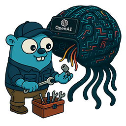

<div align="center">
    <br />
    <br />
</div>

# OpenAI Tool Adapter

[](https://golang.org)
[](https://github.com/juburr/openai-tool-adapter)
[](https://goreportcard.com/report/github.com/juburr/openai-tool-adapter)
[](LICENSE)

A high-performance Go package that enables seamless function calling for Large Language Models that lack native tool support. By transforming OpenAI-style tool requests into prompt-based instructions and intelligently parsing responses back into structured tool calls, it creates a transparent compatibility layer that maintains the familiar OpenAI API while supporting any instruction-following model.

## ✨ Key Features

* **🔄 OpenAI SDK Compatible** - Uses official `github.com/openai/openai-go/v2` types for seamless integration
* **⚡ Streaming & Unary Support** - Full compatibility with both standard and streaming chat completions
* **🎯 Robust Response Parsing** - Finite state machine JSON extraction reliably handles diverse LLM response formats
* **💬 Multi-turn Tool Conversations** - Automatic handling of `ToolMessage` results in conversation history
* **🚀 High-Performance Processing** - Optimized prompt generation and JSON parsing for minimal latency
* **🔍 Complete Observability** - Type-safe metrics and structured logging without vendor lock-in
* **🛡️ Production Ready** - Battle-tested with comprehensive error handling and edge case coverage

## 🚀 Quick Start

### Installation
```bash
go get github.com/juburr/openai-tool-adapter
go get github.com/openai/openai-go/v2
```

### Basic Usage

> [!IMPORTANT]  
> Only use this adapter for models that lack native function calling support. Determine your model's capabilities independently and apply the adapter only when necessary.

```go
package main

import (
    "context"
    "fmt"
    "log"
    
    "github.com/juburr/openai-tool-adapter"
    "github.com/openai/openai-go/v2"
    "github.com/openai/openai-go/v2/option"
)

func main() {
    // Initialize the tool adapter
    adapter := tooladapter.New()
    
    // Create OpenAI client
    client := openai.NewClient(option.WithAPIKey("your-api-key"))
    
    // Define your tools (standard OpenAI format)
    tools := []openai.ChatCompletionToolParam{
        {
            Type: "function",
            Function: openai.FunctionDefinitionParam{
                Name:        "get_weather",
                Description: openai.String("Get current weather for a location"),
                Parameters: openai.FunctionParameters{
                    "type": "object",
                    "properties": map[string]interface{}{
                        "location": map[string]interface{}{
                            "type":        "string",
                            "description": "City name",
                        },
                    },
                    "required": []string{"location"},
                },
            },
        },
    }
    
    // Create your request (standard OpenAI format)
    request := openai.ChatCompletionNewParams{
        Model: openai.ChatModelGPT4o, // Any model without native tool support
        Messages: []openai.ChatCompletionMessageParamUnion{
            openai.UserMessage("What's the weather like in San Francisco?"),
        },
        Tools: tools,
    }
    
    // Transform request for non-native models
    transformedRequest, err := adapter.TransformCompletionsRequest(request)
    if err != nil {
        log.Fatal(err)
    }
    
    // Send to your LLM service
    ctx := context.Background()
    response, err := client.Chat.Completions.New(ctx, transformedRequest)
    if err != nil {
        log.Fatal(err)
    }
    
    // Transform response back to OpenAI format
    finalResponse, err := adapter.TransformCompletionsResponse(response)
    if err != nil {
        log.Fatal(err)
    }
    
    // Use response with standard OpenAI tool calling logic
    if len(finalResponse.Choices) > 0 && len(finalResponse.Choices[0].Message.ToolCalls) > 0 {
        for _, toolCall := range finalResponse.Choices[0].Message.ToolCalls {
            fmt.Printf("Function: %s\nArguments: %s\n", 
                toolCall.Function.Name, 
                toolCall.Function.Arguments)
        }
    }
}
```

### Multi-turn Conversations with Tool Results

The adapter automatically handles tool results in multi-turn conversations. When you include `ToolMessage` types in your conversation history, they are extracted and converted into natural language prompts that the model can understand:

```go
// Multi-turn conversation with tool results
request := openai.ChatCompletionNewParams{
    Model: "gpt-4", 
    Messages: []openai.ChatCompletionMessageParamUnion{
        openai.UserMessage("What's the weather in San Francisco?"),
        // Assistant responds with tool calls (from previous interaction)
        openai.AssistantMessage("I'll check the weather for you.", 
            openai.ToolCall{
                ID: "call_123", 
                Type: "function", 
                Function: openai.Function{
                    Name: "get_weather", 
                    Arguments: `{"location": "San Francisco"}`,
                },
            },
        ),
        // Tool result from executing the tool
        openai.ToolMessage("The weather in San Francisco is 72°F and sunny.", "call_123"),
        // New user request
        openai.UserMessage("Can you format that into a nice summary?"),
    },
    Tools: tools, // Optional: can be omitted if no new tools needed
}

transformedRequest, err := adapter.TransformCompletionsRequest(request)
// Tool results are automatically converted to natural language context
```

The adapter handles four different scenarios:
1. **No tools or results**: Request passes through unchanged
2. **Tools only**: Original behavior - tools injected into system prompt  
3. **Tool results only**: Results converted to natural language context (useful for final iterations)
4. **Both tools and results**: Tool definitions + previous results both included in prompt

### Configuration Options

```go
// Configure with multiple options including tool processing policies
adapter := tooladapter.New(
    tooladapter.WithCustomPromptTemplate(template),
    tooladapter.WithLogger(logger),
    tooladapter.WithMetricsCallback(callback),
    tooladapter.WithSystemMessageSupport(true), // Enable for models that support system messages
    tooladapter.WithToolPolicy(tooladapter.ToolStopOnFirst), // Control tool processing
    tooladapter.WithToolMaxCalls(5), // Limit tool calls for safety
)

// Use pre-configured option sets
adapter := tooladapter.New(tooladapter.WithLogLevel(slog.LevelInfo))
```

### Streaming Support

```go
// Create streaming request
stream := client.Chat.Completions.NewStreaming(ctx, transformedRequest)

// Wrap with adapter
adaptedStream := adapter.TransformStreamingResponse(stream)
defer adaptedStream.Close()

// Process stream with real-time tool call detection
for adaptedStream.Next() {
    chunk := adaptedStream.Current()
    // Handle tool calls and content as they arrive
}
```

## 📖 Documentation

### Core Documentation
- **[Architecture Guide](docs/ARCHITECTURE.md)** - System design and technical architecture
- **[Configuration Options](docs/CONFIGURATION.md)** - Complete configuration reference
- **[Streaming Guide](docs/STREAMING.md)** - Real-time processing and streaming support

### Advanced Topics
- **[Observability](docs/LOGGING.md)** - Structured logging and operational events
- **[Metrics Integration](docs/METRICS.md)** - Performance monitoring and platform integration

## 🔧 Configuration Reference

### Available Options

| Option | Description | Use Case |
|--------|-------------|----------|
| `WithCustomPromptTemplate(string)` | Override default tool prompt template | Custom instruction formatting |
| `WithLogger(*slog.Logger)` | Set custom structured logger | Production logging integration |
| `WithLogLevel(slog.Level)` | Set logging level with default handler | Simple log level control |
| `WithMetricsCallback(func)` | Enable metrics collection | Performance monitoring |
| `WithSystemMessageSupport(bool)` | Enable/disable system message support | Model-specific message role handling |
| `WithToolCollectWindow(time.Duration)` | Set collection timeout window | Time-based tool collection limits |
| `WithToolPolicy(ToolPolicy)` | Control tool processing behavior | Latency vs completeness trade-offs |
| `WithToolMaxCalls(int)` | Limit maximum tool calls processed | Safety and resource management |
| `WithToolCollectMaxBytes(int)` | Limit maximum bytes during tool collection | Memory safety and resource protection |
| `WithCancelUpstreamOnStop(bool)` | Cancel upstream context when stopping | Resource conservation in streaming |
| `WithStreamingToolBufferSize(int)` | Set maximum streaming buffer size | Control memory usage during streaming tool parsing |
| `WithPromptBufferReuseLimit(int)` | Set buffer pool reuse threshold | Memory management in high-throughput environments |
| `WithStreamingEarlyDetection(int)` | Enable early tool call detection in streaming | Prevent preface text emission when tool calls follow |

### Pre-configured Option Sets

| Option Set | Configuration | Best For |
|------------|---------------|----------|
| `WithLogger()` | Custom logger (JSON or text) | Any environment |
| `WithLogLevel()` | Level-only using default handler | Simple setups |

## 📊 Observability

The adapter provides comprehensive observability without vendor lock-in:

```go
// Complete observability setup
adapter := tooladapter.New(
    // Structured logging (integrates with any log system)
    tooladapter.WithLogger(slog.New(slog.NewJSONHandler(os.Stdout, nil))),
    
    // Type-safe metrics (works with any monitoring platform)
    tooladapter.WithMetricsCallback(func(data tooladapter.MetricEventData) {
        switch eventData := data.(type) {
        case tooladapter.ToolTransformationData:
            // Send to Prometheus, DataDog, New Relic, etc.
            yourMetrics.RecordTransformation(eventData)
            
        case tooladapter.FunctionCallDetectionData:
            // High-precision timing with nanosecond accuracy
            yourMetrics.RecordProcessingTime(eventData.Performance.ProcessingDuration)
        }
    }),
)
```

## ⚡ Performance
The OpenAI Tool Adapter delivers excellent performance across both transformation entry points. Expect microsecond-level transformations with very few memory allocations. Performance remains highly predictable regardless of complexity, making it suitable for production workloads.

### Benchmark Data
**Date:** Aug 13, 2025  
**Release:** v1.0.0  
**Processor:** AMD Ryzen 9 9950X3D  

🏎️ **Request Transformations** (tool injection into prompts)

- Tiny (1 tool): `1.75 μs/op, 2.99 KB/op, 32 allocs/op`
- Small (5 tools): `8.38 μs/op, 11.69 KB/op, 167 allocs/op`
- Medium (20 tools): `33.51 μs/op, 44.49 KB/op, 689 allocs/op`
- Large (50 tools): `81.58 μs/op, 108.90 KB/op, 1686 allocs/op`

🐎 **Response Transformations** (function call detection & parsing)

- Tiny (no tool calls): `0.24 μs/op, 0.19 KB/op, 1 alloc/op`
- Small (single tool call): `2.58 μs/op, 3.35 KB/op, 32 allocs/op`
- Medium (multiple tool calls): `6.33 μs/op, 6.18 KB/op, 46 allocs/op`
- Large (many tool calls): `21.62 μs/op, 23.40 KB/op, 80 allocs/op`
- Large (complex tool call): `7.76 μs/op, 9.17 KB/op, 36 allocs/op`
- Large (mixed content): `4.90 μs/op, 7.55 KB/op, 33 allocs/op`

### Running Benchmarks
Run performance benchmarks to validate performance on your hardware:

```bash
# Run all benchmarks
go test -bench=. -benchmem ./...

# JSON performance benchmarks
go test -bench=JSON ./...

# Parser-specific benchmarks
go test -bench=Parser -benchmem ./...
```

**Performance Characteristics:**
- **Linear scaling** - Performance scales proportionally with content size
- **Zero-allocation operations** - Core string processing has no memory overhead
- **Sub-microsecond parsing** - Most operations complete in microseconds or faster
- **Predictable behavior** - Consistent allocation patterns across scenarios

## 🧪 Testing

```bash
# Run all tests
go test ./...

# Run with coverage
go test -race -coverprofile=coverage.out ./...
go tool cover -html=coverage.out

# Test with benchmarking
go test -bench=. ./...

# Run fuzzing tests
go test -fuzz=FuzzJSONExtractor -fuzztime=30s
go test -fuzz=FuzzValidateFunctionName -fuzztime=30s
go test -fuzz=FuzzTransformCompletionsResponse -fuzztime=30s

# Run end-to-end integration tests
# Requires a running vLLM instance with Gemma 3
cd e2e && go test -tags e2e -v .
```

The test suite includes:
- **High code coverage** with comprehensive edge case testing
- **Fuzz testing** for JSON parsing, function validation, and response transformation
- **Production scenario testing** including resource exhaustion and malicious input handling
- **Concurrency stress testing** with race condition detection
- **Integration testing** for real-world usage patterns

## 🤝 Contributing

Contributions are welcome! Please:

1. Fork the repository
2. Create a feature branch (`git checkout -b feature/amazing-feature`)
3. Commit your changes (`git commit -m 'feat: new amazing feature description'`)
4. Push to the branch (`git push origin feature/amazing-feature`)
5. Open a Pull Request

Commit prefixes should use the [Conventional Commits](https://www.conventionalcommits.org/en/v1.0.0/) standard: `feat:`, `fix:`, `docs:`, `style:`, `refactor:`, `perf:`, `test:`, `build:`, `ci:`, `revert`, or `chore:`. These popular extensions are also okay: `deps:`, `sec:`, `infra:`, `release:`, and `wip:`.

## 📄 License

This project is licensed under the Apache 2 License - see the [LICENSE](LICENSE) file for details.

## 🙏 Acknowledgments

- [Philipp Schmid](https://www.philschmid.de/gemma-function-calling) for pioneering the prompt-based function calling technique
- [Google's Gemma team](https://ai.google.dev/gemma/docs/capabilities/function-calling) for validating and documenting the approach
- The OpenAI team for their excellent [Go SDK](https://github.com/openai/openai-go)
- The open-source community for continuous improvements and feedback
- [Claude Code](https://www.anthropic.com/claude-code) for being my copilot on this journey and allowing me to throw this package together so quickly

**⭐ Star this repository if it helps you build better LLM applications!**
