# 🏗️ Architecture Guide

This document provides a comprehensive overview of the OpenAI Tool Adapter's architecture, design principles, and implementation details.

## System Overview

The OpenAI Tool Adapter acts as a transparent compatibility layer between OpenAI-compatible clients and Large Language Models that lack native function calling support. It achieves this through a sophisticated two-phase transformation process.

```mermaid
flowchart TD
    A[🔌 <b>OpenAI Client</b>] -->|"<b>1. OpenAI Request</b><br/>with Native Tool List"| B{🧰 <b>OpenAI Tool Adapter</b>}
    B -->|"<b>2. OpenAI Request</b><br/>Tool list and special<br />calling instructions<br/>in prompt"| C[🤖 <b>LLM</b><br />Without Native Tool support]
    C -->|"<b>3. OpenAI Response</b><br/>Tool call in assistant<br/>response as JSON"| B
    B -->|"<b>4. OpenAI Response</b><br/>with Native Tool Call"| A
```



## Core Components

### 1. Tool Result Processor (`adapter.go`)

Handles multi-turn conversations with tool results by extracting `ToolMessage` types and converting them to natural language context.

**Key Functions:**
- **`extractToolResults()`** - Detects and parses `ToolMessage` types from conversation history
- **`buildToolResultsPrompt()`** - Converts tool results to natural language context  
- **Multi-scenario handling** - Supports tools-only, results-only, both, or neither

**Integration Points:**
- Processes messages before tool definition injection
- Removes `ToolMessage` types from conversation flow
- Combines tool results with tool definitions when both present

### 2. Adapter Engine (`adapter.go`)

The central orchestration component that manages the transformation pipeline.

**Key Responsibilities:**
- Request/response transformation coordination
- Configuration management and option application
- Context propagation for cancellation and timeouts
- Metrics emission and operational logging
- Error handling and recovery

**Architecture Patterns:**
- **Functional Options Pattern** - Flexible configuration without breaking changes
- **Context Propagation** - Proper cancellation and timeout handling
- **Observer Pattern** - Metrics collection without vendor lock-in

```go
type Adapter struct {
    logger              *slog.Logger
    promptTemplate      string
    metricsCallback     func(MetricEventData)
    bufferPool         *sync.Pool
    
    // Tool policy configuration
    toolPolicy           ToolPolicy
    toolCollectWindow    time.Duration
    toolMaxCalls         int
    toolCollectMaxBytes  int
    cancelUpstreamOnStop bool
}
```

### 3. State Machine Parser (`parser.go`)

A robust finite state machine for JSON extraction from varied LLM response formats.

**Design Philosophy:**
Unlike regular expressions, the state machine approach provides:
- **Correctness** - Handles nested JSON, escaped characters, and edge cases
- **Performance** - Avoids regex backtracking issues
- **Maintainability** - Clear state transitions and extensible design
- **Robustness** - Graceful handling of malformed JSON

**State Machine Architecture:**


**Key Features:**
- **Depth Tracking** - Handles arbitrarily nested structures
- **Escape Sequence Handling** - Properly processes escaped quotes and characters
- **Multiple Format Support** - Extracts JSON from code blocks, plain text, and mixed content
- **Partial JSON Detection** - Identifies incomplete JSON for streaming scenarios

### 4. Streaming Engine (`streaming.go`)

Real-time tool call detection for streaming responses with policy-driven processing and intelligent buffering.

**Streaming Architecture:**


**Tool Processing Policies:**
- **ToolStopOnFirst** - Lowest latency, stops on first tool detection
- **ToolCollectThenStop** - Batches tools with configurable timeouts
- **ToolDrainAll** - Processes entire stream, collects all tools  
- **ToolAllowMixed** - Preserves both content and tools

**Buffer Management:**
- **Policy-Aware Buffering** - Buffer strategy adapts to tool policy
- **Safety Limits** - Configurable byte and tool count limits
- **Smart Detection** - Only buffers when JSON patterns are detected
- **Automatic Fallback** - Gracefully handles buffer overflow
- **Context Awareness** - Respects cancellation and timeouts

### 5. Metrics System (`metrics.go`)

Type-safe observability without vendor lock-in using the observer pattern.

**Metrics Architecture:**
```go
type MetricEventData interface {
    EventType() MetricEventType
}

type ToolTransformationData struct {
    ToolCount    int                   `json:"tool_count"`
    ToolNames    []string              `json:"tool_names"`
    PromptLength int                   `json:"prompt_length"`
    Performance  PerformanceMetrics    `json:"performance"`
}

type FunctionCallDetectionData struct {
    FunctionCount   int                `json:"function_count"`
    FunctionNames   []string           `json:"function_names"`
    ContentLength   int                `json:"content_length"`
    JSONCandidates  int                `json:"json_candidates"`
    Streaming       bool               `json:"streaming"`
    Performance     PerformanceMetrics `json:"performance"`
}
```

**Benefits:**
- **Vendor Agnostic** - Works with Prometheus, DataDog, custom systems
- **Type Safety** - Compile-time guarantees for metric data
- **High Precision** - Nanosecond-accurate timing with `time.Duration`
- **Performance Friendly** - Minimal overhead, async processing support

### 6. Configuration System (`options.go`)

Flexible configuration using the functional options pattern.

**Design Benefits:**
- **Backward Compatibility** - New options don't break existing code
- **Composability** - Options can be combined and reused
- **Validation** - Configuration is validated at construction time
- **Preset Support** - Pre-configured option sets for common scenarios

```go
type Option func(*Adapter)

func WithLogger(logger *slog.Logger) Option {
    return func(a *Adapter) {
        if logger == nil {
            logger = slog.New(&noopHandler{})
        }
        a.logger = logger
    }
}
```

## Design Principles

### 1. Transparency

The adapter maintains complete API compatibility with OpenAI's interface:
- **Input Compatibility** - Accepts standard OpenAI request structures
- **Output Compatibility** - Returns standard OpenAI response structures
- **Error Handling** - Preserves OpenAI error semantics
- **Behavioral Consistency** - Maintains expected OpenAI behavior patterns

### 2. Performance

Every component is designed for high-performance production use:
- **Object Pooling** - Reuses buffers and temporary objects
- **Zero-Copy Operations** - Minimizes memory allocations where possible
- **Lazy Evaluation** - Only processes data when necessary
- **Efficient Algorithms** - State machines over regex, linear scaling

### 3. Reliability

Production-grade reliability through comprehensive error handling:
- **Graceful Degradation** - Falls back to content when tool parsing fails
- **Input Validation** - Validates all inputs with helpful error messages
- **Resource Management** - Proper cleanup and resource limits
- **Context Handling** - Respects cancellation and timeout requests

### 4. Observability

Built-in observability without vendor lock-in:
- **Structured Logging** - Operational events with consistent formatting
- **Metrics Integration** - Type-safe metrics for any monitoring system
- **Performance Monitoring** - High-precision timing and resource usage
- **Debug Support** - Detailed debugging information when needed

## Request/Response Flow

### Phase 1: Request Transformation


**Process:**
1. **Tool Extraction** - Parse tool definitions from request
2. **Prompt Generation** - Convert tools to instruction format using template
3. **Message Injection** - Add tool prompt as system message
4. **Field Removal** - Remove `tools` and `tool_choice` fields
5. **Validation** - Ensure request is valid for standard LLM processing

**Template System:**
```go
const DefaultTemplate = `You are a helpful assistant with access to functions. Use them when appropriate.

Available functions:
%s

To use a function, respond with a JSON array containing function calls in this format:
[{"name": "function_name", "parameters": {"param1": "value1", "param2": "value2"}}]

Important: Respond with valid JSON only when using functions. For other responses, use natural language.`
```

### Phase 2: Response Transformation


**Process:**
1. **Content Scanning** - Search for JSON patterns in response
2. **JSON Extraction** - Use state machine to extract complete JSON blocks
3. **Function Parsing** - Parse extracted JSON into function call structures
4. **Validation** - Validate function names and parameter formats
5. **ID Generation** - Create unique tool call IDs (UUIDv7-based)
6. **Response Reconstruction** - Build OpenAI-compatible response structure

## Performance Characteristics

### Benchmarks

Based on comprehensive benchmarking on AMD Ryzen 9 9950X3D:

| Operation | Performance | Memory | Allocations |
|-----------|-------------|--------|-------------|
| Core rune operations | 1.34 ns/op | 0 B/op | 0 allocs/op |
| Single backtick parsing | 89.0 ns/op | 64 B/op | 2 allocs/op |
| JSON extraction (mixed) | 3.39 μs/op | 4,000 B/op | 32 allocs/op |
| Function call processing | 1.03 μs/op | 769 B/op | 16 allocs/op |
| Streaming detection | 115.8 ns/op | 160 B/op | 1 alloc/op |

### Scaling Behavior

- **Linear Scaling** - Performance scales linearly with content size
- **Memory Efficiency** - Proportional memory usage without excess overhead
- **No Degradation** - Maintains efficiency at high volumes
- **Predictable Behavior** - Consistent allocation patterns

## Error Handling Strategy

### Error Categories

1. **Configuration Errors** - Invalid templates, nil loggers
2. **Validation Errors** - Invalid function names, malformed parameters
3. **Processing Errors** - JSON parsing failures, extraction issues
4. **System Errors** - Context cancellation, resource limits
5. **Network Errors** - Upstream failures, timeout conditions

### Error Recovery

```go
// Graceful degradation example
func (a *Adapter) TransformCompletionsResponse(resp openai.ChatCompletion) (openai.ChatCompletion, error) {
    if len(resp.Choices) == 0 {
        return resp, nil // No choices to process
    }
    
    content := resp.Choices[0].Message.Content
    if content == "" {
        return resp, nil // No content to parse
    }
    
    // Attempt to extract tool calls
    toolCalls, err := a.extractor.ExtractFunctionCalls(content)
    if err != nil {
        // Log error but continue with original response
        a.logger.Debug("Tool call extraction failed", "error", err)
        return resp, nil
    }
    
    // Successfully extracted tool calls
    return a.buildToolResponse(resp, toolCalls), nil
}
```

## Memory Management

### Object Pooling

The adapter uses object pools for frequently allocated objects:

```go
var bufferPool = sync.Pool{
    New: func() interface{} {
        return &bytes.Buffer{}
    },
}

func (a *Adapter) getBuffer() *bytes.Buffer {
    buf := bufferPool.Get().(*bytes.Buffer)
    buf.Reset()
    return buf
}

func (a *Adapter) putBuffer(buf *bytes.Buffer) {
    if buf.Cap() < maxPoolBufferSize {
        bufferPool.Put(buf)
    }
}
```

### Resource Limits

Built-in protection against resource exhaustion:

```go
const (
    MaxToolCount        = 1000
    MaxFunctionNameLen  = 64
    MaxPromptLength     = 1024 * 1024 // 1MB
    MaxBufferSize       = 10 * 1024 * 1024 // 10MB
)
```

## Concurrency Model

### Thread Safety

- **Adapter Instances** - Safe for concurrent use across goroutines
- **Configuration** - Immutable after construction
- **State Machine** - Stateless parsing with local variables
- **Buffer Pools** - Thread-safe with sync.Pool

### Context Handling

```go
func (a *Adapter) TransformCompletionsRequestWithContext(ctx context.Context, req openai.ChatCompletionNewParams) (openai.ChatCompletionNewParams, error) {
    // Check for cancellation before expensive operations
    select {
    case <-ctx.Done():
        return openai.ChatCompletionNewParams{}, ctx.Err()
    default:
    }
    
    // Perform transformation with periodic cancellation checks
    return a.transformRequestInternal(ctx, req)
}
```

## Extensibility Points

### Custom Templates

```go
// Custom template for specific LLM behavior
customTemplate := `AI Assistant with Tools:

Available tools: %s

When using tools, respond with JSON array:
[{"name": "tool_name", "parameters": {...}}]

Use natural language for regular responses.`

adapter := tooladapter.New(
    tooladapter.WithCustomPromptTemplate(customTemplate),
)
```

### Metrics Integration

```go
// Custom metrics for specific monitoring needs
adapter := tooladapter.New(
    tooladapter.WithMetricsCallback(func(data tooladapter.MetricEventData) {
        switch eventData := data.(type) {
        case tooladapter.ToolTransformationData:
            customMetrics.RecordTransformation(eventData)
        case tooladapter.FunctionCallDetectionData:
            customMetrics.RecordDetection(eventData)
        }
    }),
)
```

### Parser Extensions

The state machine parser can be extended for new JSON formats:

```go
// Custom JSON format handler
type CustomJSONHandler struct {
    *JSONExtractor
}

func (h *CustomJSONHandler) ExtractCustomFormat(content string) ([]FunctionCall, error) {
    // Custom extraction logic
    return h.parseCustomJSON(content)
}
```

## Testing Architecture

### Test Structure

- **Unit Tests** - Component-level testing with mocks and stubs
- **Integration Tests** - End-to-end workflow testing
- **Benchmark Tests** - Performance regression detection
- **Property Tests** - Fuzz testing for edge case discovery
- **Race Tests** - Concurrency safety validation

### Coverage Strategy

- **High Code Coverage** - Comprehensive line and branch coverage
- **Edge Case Testing** - Malformed inputs, resource exhaustion
- **Error Path Testing** - All error conditions and recovery paths
- **Performance Testing** - Benchmark validation and regression detection

This architecture provides a robust, performant, and maintainable foundation for OpenAI tool compatibility across diverse LLM implementations.